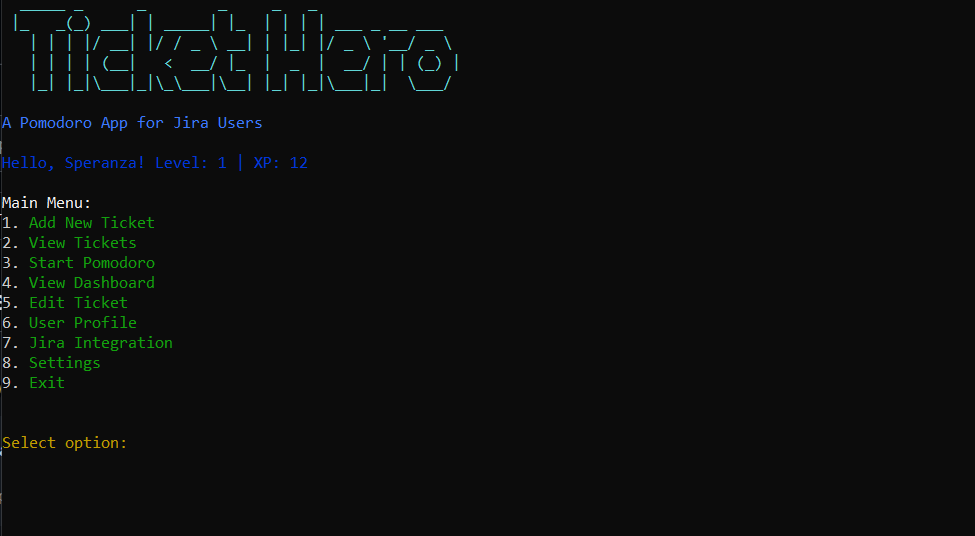
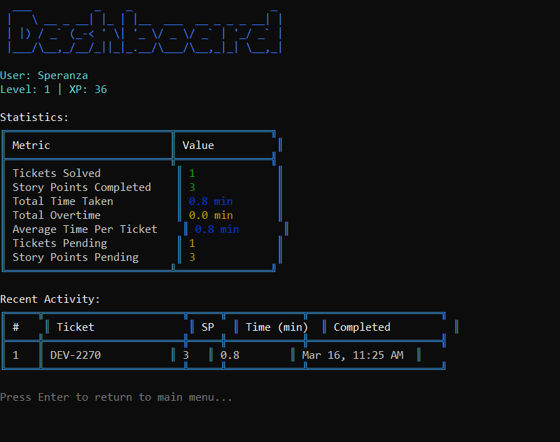
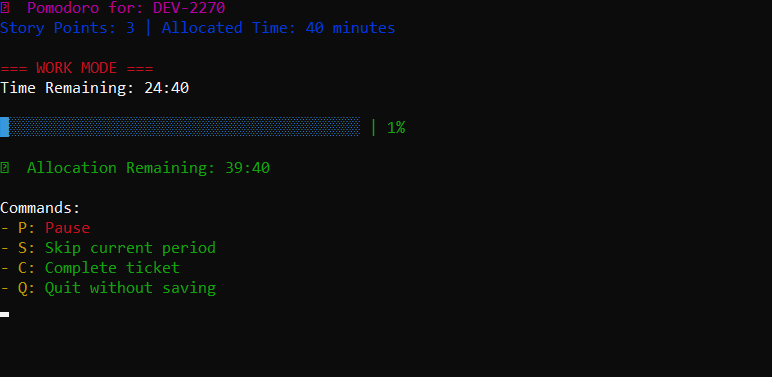
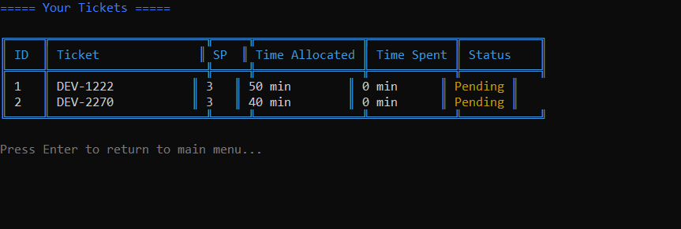

# Ticket Hero SDK


A command-line Pomodoro timer and task management application designed specifically for Jira users. Ticket Hero helps you track time spent on tickets, earn XP for completing tasks, and manage your work with the Pomodoro technique.

## Features

- **Pomodoro Timer**: Work in focused 25-minute intervals with automatic breaks
- **Ticket Management**: Add, view, and edit tickets with story points and allocated time
- **Gamified Experience**: Earn XP and level up as you complete tickets
- **Dashboard**: View statistics and recent activity
- **User Profiles**: Create and update your profile
- **Progress Tracking**: Visual progress bars during Pomodoro sessions
- **Configurable Settings**: Customize Pomodoro durations, XP rates, and UI preferences

## Installation

### Global Installation (Recommended)

```bash
npm install -g ticket-hero-sdk
```

After installation, you can start the application from anywhere using:

```bash
ticket-hero
```

### Local Installation

```bash
npm install ticket-hero-sdk
npx ticket-hero
```

## Usage

### Main Menu

Upon starting Ticket Hero, you'll be presented with the main menu:

1. **Add New Ticket** - Create new tickets with name, story points, and allocated time
2. **View Tickets** - See all your tickets and their status
3. **Start Pomodoro** - Select a ticket to work on with the Pomodoro technique
4. **View Dashboard** - See your stats and recent activity
5. **Edit Ticket** - Modify existing tickets
6. **User Profile** - Update your user profile
7. **Exit** - Close the application

### Pomodoro Controls

During a Pomodoro session, you can use the following keyboard commands:

- **P**: Pause/Resume the timer
- **S**: Skip the current period
- **C**: Complete the ticket
- **Q**: Quit without saving progress

### Configuration

Ticket Hero can be configured by creating or editing the `config.json` file in the same directory as the application. Default settings are provided, but you can customize:

```json
{
  "pomodoro": {
    "workDuration": 25,
    "shortBreakDuration": 5,
    "longBreakDuration": 15,
    "longBreakInterval": 4,
    "autoStartBreaks": true,
    "autoStartPomodoros": false
  },
  "xp": {
    "baseXpPerStoryPoint": 10,
    "earlyCompletionBonusPercent": 20,
    "xpLevelThresholdMultiplier": 100
  },
  "app": {
    "dataFile": "ticket-hero-data.json",
    "backupFrequencyInHours": 24,
    "maxBackups": 5
  },
  "ui": {
    "colorTheme": "default",
    "useEmojis": true,
    "showProgressBar": true
  }
}
```

## Data Storage

All data is stored locally in a JSON file (`ticket-hero-data.json` by default). This includes:

- User profile information
- Ticket details
- Statistics and progress

## Screenshots

### Main Menu


### Dashboard View


### Pomodoro Timer


### Ticket View


## Credits

Ticket Hero uses the following npm packages:

- [chalk](https://www.npmjs.com/package/chalk) - Terminal string styling
- [cli-progress](https://www.npmjs.com/package/cli-progress) - Progress bars in the terminal
- [cli-table3](https://www.npmjs.com/package/cli-table3) - Tables in the terminal
- [figlet](https://www.npmjs.com/package/figlet) - ASCII art from text
- [ora](https://www.npmjs.com/package/ora) - Elegant terminal spinners

## License

This project is licensed under the MIT License - see the [LICENSE](LICENSE) file for details.